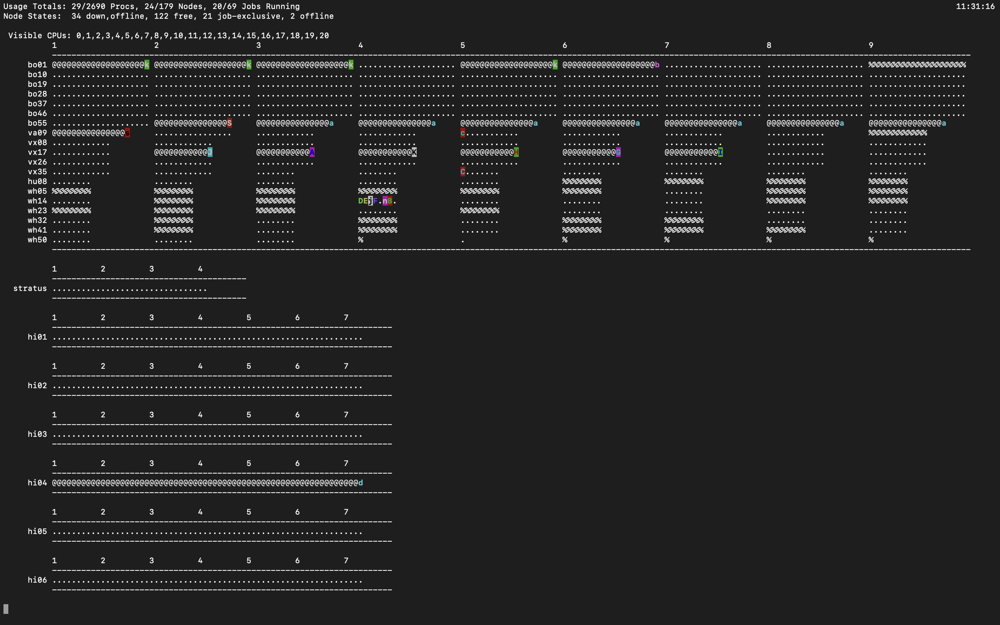

# Logging in and Setting up your HPC Account {#setup}

## Login

Open a terminal on your computer and type: `ssh [wm_username]@[subcluster_name].sciclone.wm.edu`. When prompted for a password, enter your W&M password.

Your terminal should now look similar to this:

## Home Workspace

Type `pwd` (print working directory) into your terminal. It should print out: `/sciclone/home20/<wm_username>`.

This is your landing directory - you'll open to this every time you login.

Now type `ls` into your terminal. If this is the first time you are loggin in, you should see 4 folders print out. You can find read more about the purpose of each of these folders here: <https://www.wm.edu/offices/it/services/researchcomputing/using/files/index.php>

## Working Folders

You are free to make as many folders here as you like, as long as you do not store large amounts of data in them.

Best practice is to store code files within your home20 directory and data within a folder provided to you by Dan (or another professor) in either `/sciclone/geograd/` or `/sciclone/geounder/`

You can make a new folder using the `mkdir <folder_name>` command

## PBSTOP

Type `pbstop` into your terminal. You should see a screen that looks like this:

This is your 'birdseye view' of the cluster.

Some helpful terminology:

`Cluster: The cluster is the set of all subclusters wihtin the W&M HPC system.`

`Subcluster: a set of computers with similar comutuing charactheristics.`

W&M's HPC has multiple subclsuters incluiding Vortex, Bora, Hima, Meltemi, etc... You can read about each of them here: <https://www.wm.edu/offices/it/services/researchcomputing/hw/nodes/index.php>

`Node: A node is an individual computer within a subcluster.`

`Core (aka Processor): An individual processor on a node.`

Each node on Vortex has 12 processors. This basically means you can run 12 individual python processes on a Vortex node, or 1 process on each processor. You could also run one process across multiple processors (or the whole node) if you need all of the memory available.

## Conda Environments

Setting up Conda environments on the clsuter is very similar to how you would do it on your local computer. It is highly recommended that you use conda environments when using the HPC.

To create a conda environment and install pacakges, first copy these two lines into your terminal and hit enter.

`source "/usr/local/anaconda3-2021.05/etc/profile.d/conda.csh"`

`module load anaconda3/2021.05`

This will source and load the Anaconda module so it os ready for you to use.

Next, follow the standard steps for creating a conda environment. Use the following line to create your environment and type y when prompted `Proceed ([y]/n)?`

`conda create -n [ENVNAME]`

Next, activate your neew environemtn by typing:

`conda activate [ENVNAME]`

To see a list of all the environments you've created, type:

`conda info --envs`

From here, you can install any packges you need for a program using standard pip install commands. I.e.:

`pip install pandas`
